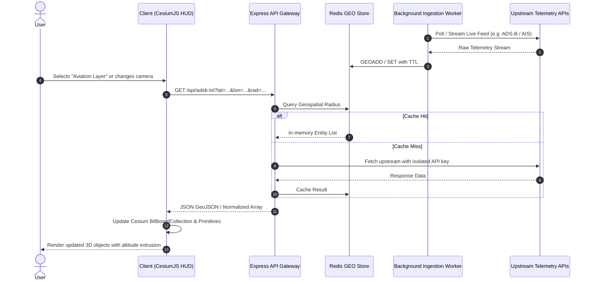

# EaglEs EyE — System Architecture Document

This document formalizes the **Layered Architecture** of EaglEs EyE as specified in the project engineering requirements (`prompt.md`).

---

## 1. Architectural Principles

1. **Strict Separation of Concerns:** Higher layers consume lower layers via clean interfaces; lower layers never directly couple to higher-level presentation primitives.
2. **Zero-Trust Client Boundary:** Third-party credentials (OpenAI, OpenSky, Google Places, NASA FIRMS, AISStream) never touch the client browser bundle. All requests are routed through dedicated proxy gateways with validation and rate limiting.
3. **High-Throughput Geospatial Indexing:** Telemetry streams (aviation vectors, maritime coordinates, thermal hotspots) are normalized to WGS84 and stored in Redis geospatial indices (`GEOADD`) for O(log(N) + M) spatial query bounding.
4. **Deterministic Testing:** Domain models, geographic calculations, and data parsing utilities must be pure and testable without active network dependencies.

---

## 2. The 11 Architectural Layers

```
┌─────────────────────────────────────────────────────────────┐
│ 1. Presentation Layer (HUD, Panels, Audio, Shaders)         │
├─────────────────────────────────────────────────────────────┤
│ 2. Client Layer (CesiumJS 3D Viewport, Camera, Entities)   │
├─────────────────────────────────────────────────────────────┤
│ 3. Entrypoint Layer (Vite Dev Server, Express Gateway)      │
├─────────────────────────────────────────────────────────────┤
│ 4. Application Layer (Workflow Services & Layer Managers)   │
├─────────────────────────────────────────────────────────────┤
│ 5. Provider Layer (Provider Plugins & External Adapters)    │
├─────────────────────────────────────────────────────────────┤
│ 6. Persistence Layer (Redis Key-Value & Geospatial Store)   │
├─────────────────────────────────────────────────────────────┤
│ 7. Domain Layer (Entities, Value Objects, Geo-Math)         │
├─────────────────────────────────────────────────────────────┤
│ 8. Background Layer (Live Telemetry Ingestion Workers)      │
├─────────────────────────────────────────────────────────────┤
│ 9. Configuration Layer (Typed Env & Secret Management)      │
├─────────────────────────────────────────────────────────────┤
│ 10. CLI Layer (Setup Doctor, Telemetry Probes)              │
├─────────────────────────────────────────────────────────────┤
│ 11. Tooling Layer (Testing Framework, Build Bundlers)       │
└─────────────────────────────────────────────────────────────┘
```

### 1. Presentation Layer (`src/ui/`, `src/styles/`)

- Renders the cybernetic Heads-Up Display (HUD), tactical sidebar, layer selectors, audio chimes, and camera telemetry readouts.
- Responsive layout adapting from ultra-wide command center displays to mobile screens.

### 2. Client Layer (`src/globe/`, `src/layers/`)

- Direct interaction with the CesiumJS `Viewer`.
- Manages 3D tilesets, terrain providers, billboard collections, polyline primitives, dynamic point extrusions, and camera fly-to animations.

### 3. Entrypoint Layer (`server/index.ts`, `server/api/`)

- HTTP entrypoints and middleware stack.
- Reverse-proxy routers, CORS policy enforcement, rate limiting, and request payload validation.

### 4. Application Layer (`server/application/`)

- Orchestrates multi-step workflows such as regional intelligence briefings, spatial cross-referencing (e.g. finding CCTV cameras within 2km of a fire perimeter), and Voice AI sessions.

### 5. Provider Layer (`server/providers/`)

- Adapters for all 23 external data providers (ADS-B Lol, OpenSky, AIS, Open-Meteo, NASA FIRMS, CelesTrak, Overpass OSM, Google Places).
- Normalizes disparate vendor JSON schemas into uniform domain entities.

### 6. Persistence Layer (`server/persistence/`)

- Encapsulates Redis connections.
- Implements `GeoRepository<T>` providing spatial radius queries, bounding box filtering, and caching with TTL invalidation.

### 7. Domain Layer (`server/domain/`)

- Pure business logic, entity models (`CctvEntity`, `CycloneEntity`, `FirmsEntity`, `GbfsEntity`), coordinate transforms, and spatial intersection math.
- Free of any UI or database dependencies.

### 8. Background Layer (`server/workers/`)

- Asynchronous worker loops and persistent WebSocket connections (e.g. AISStream client).
- Continuously ingests streaming feeds and populates the Redis cache independently of client HTTP requests.

### 9. Configuration Layer (`server/config/`)

- Validates environment variables on process startup.
- Enforces strict typing and fails fast if required operational keys (such as `CESIUM_ION_TOKEN`) are missing or malformed.

### 10. CLI Layer (`scripts/`)

- Administrative tools, preflight diagnostics (`setup-doctor`), database clearing utilities, and layer allocation checkers.

### 11. Tooling Layer

- Build pipelines (Vite, TypeScript, Docker), unit test runner (`node --test`), code formatting (Prettier), and linting.

---

## 3. Data Flow Architecture


