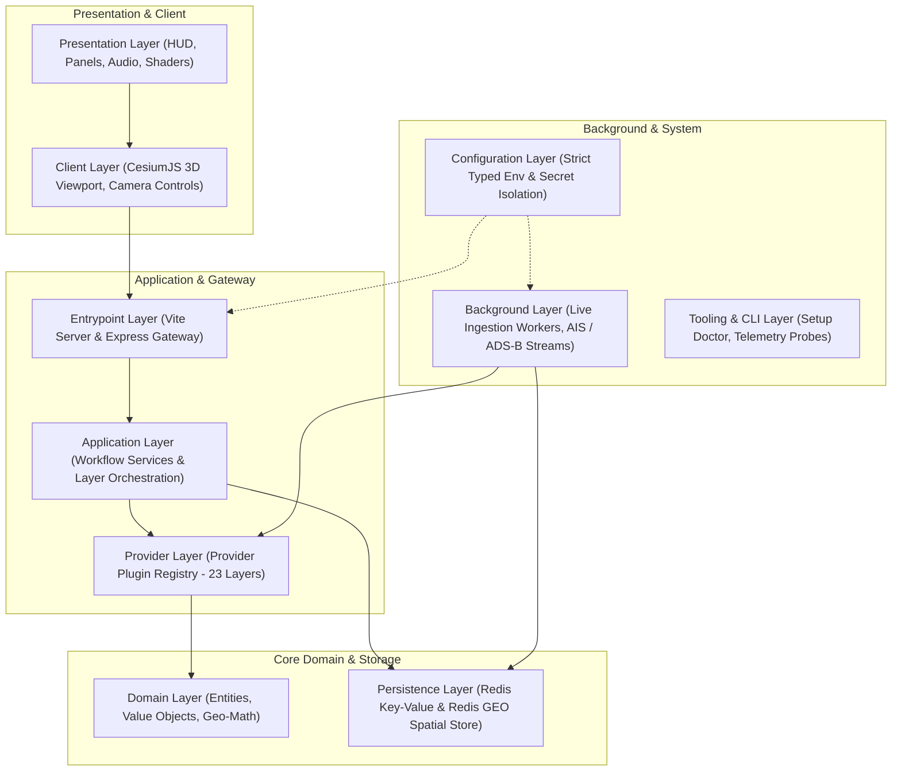

<div align="center">

# 🦅 EaglEs EyE

### Planetary Situational Awareness & Global 3D Geospatial Intelligence Engine

[](https://github.com/enrolconsultancy1-hue/EaglEs-EyE-Geospatial/actions/workflows/ci.yml)
[](https://github.com/enrolconsultancy1-hue/EaglEs-EyE-Geospatial/actions/workflows/codeql.yml)
[](https://nodejs.org/)
[](https://www.typescriptlang.org/)
[](https://cesium.com/platform/cesiumjs/)
[](https://redis.io/)
[](LICENSE)

_An independent, enterprise-grade, high-performance geospatial intelligence operating platform fusing real-time planetary telemetry onto a 3D WGS84 digital globe._

</div>

---

## 🧭 Executive Overview

**EaglEs EyE** is a real-time 3D geospatial visualization and command-and-control intelligence platform built to monitor planetary activity across air, sea, land, space, and cyberspace.

Engineered with a **strict layered architecture**, EaglEs EyE aggregates dozens of distributed telemetry feeds into an ultra-low-latency in-memory spatial index (Redis GEO) and visualizes them on a photorealistic, GPU-accelerated 3D WGS84 globe powered by **CesiumJS**.

### 🌟 Key Capabilities

- 🛰️ **3D Planetary Globe Engine:** Sub-meter geospatial precision utilizing CesiumJS, WGS84 ellipsoidal coordinates, 3D terrain meshes, dynamic day/night terminators, and atmospheric scattering.
- ✈️ **Real-Time Air Tracking:** Ingests live ADS-B, OpenSky Network, and military transponder feeds with 4D flight path extrusion and velocity vector projections.
- 🚢 **Global Maritime AIS Stream:** Live ocean vessel tracking with continuous dead reckoning and maritime safety zones.
- 🔥 **Disaster & Thermal Intelligence:** NASA FIRMS satellite fire hotspots, NOAA cyclone storm tracks, and active perimeter polygons.
- 🌦️ **Atmospheric & Weather Radar:** Live global wind streamlines, precipitation radar layers, cloud coverage, and localized METAR weather telemetry.
- 📹 **Global CCTV & Infrastructure Grid:** Dynamic discovery and live streaming of thousands of urban traffic and public cameras.
- 📡 **Space & Satellite Constellations:** CelesTrak two-line element (TLE) orbit propagation and upcoming rocket launch mission telemetry.
- 🎙️ **Voice AI & HUD Briefings:** OpenAI Realtime duplex voice interactions and real-time tactical Heads-Up Display (HUD) summaries.
- 🔒 **Zero-Trust Token Isolation:** 63 dedicated backend proxy endpoints that completely isolate upstream third-party credentials and protect rate limits.

---

## 🏛️ Architectural Blueprint

EaglEs EyE is structured as a **Clean Layered Architecture** separating concern boundaries across 11 core tiers:



Detailed architectural contracts, data flow sequences, and module boundaries are documented in [`ARCHITECTURE.md`](ARCHITECTURE.md).

---

## 🛠️ Technology Stack

| Component                | Technology                        | Rationale                                                                              |
| ------------------------ | --------------------------------- | -------------------------------------------------------------------------------------- |
| **Frontend Runtime**     | Modern Web / ES Modules + HTML5   | Zero-overhead, reactive DOM-based HUD overlays with CSS custom properties              |
| **3D Geospatial Engine** | CesiumJS (WebGL / WGS84)          | Precision high-framerate rendering of terrain, satellite orbits, 3D tiles, and vectors |
| **Backend & API Proxy**  | Node.js (TypeScript) + Express    | Asynchronous high-throughput I/O gateway for proxying 63 external telemetry APIs       |
| **Development Server**   | Vite                              | Lightning-fast HMR and seamless proxying of backend endpoints during local iteration   |
| **Spatial Persistence**  | Redis (In-Memory Key-Value & GEO) | Microsecond spatial range queries (`GEORADIUSBYMEMBER`, `GEOADD`) and TTL cache        |
| **Containerization**     | Docker + Docker Compose           | Multi-stage lightweight production builds with automated health checks                 |
| **Reverse Proxy & Edge** | Nginx                             | High-concurrency static asset delivery, SSL termination, and rate-limiting enforcement |

---

## 📡 Telemetry & Proxy API Inventory (63 Endpoints)

All external API integrations run through dedicated backend proxy controllers to prevent client credential leakage and enforce token-bucket rate limiting:

| Domain                      | Key Endpoints                                                                                                                   | Source Feeds                                              |
| --------------------------- | ------------------------------------------------------------------------------------------------------------------------------- | --------------------------------------------------------- |
| **Aviation**                | `/api/adsblol/mil`, `/api/adsb-lol`, `/api/adsbdb`, `/api/opensky`, `/api/open-sky`, `/api/opensky-track`, `/api/adsblol/trace` | ADS-B Lol, OpenSky Network, ADSBdb                        |
| **Maritime**                | `/api/ais-live`                                                                                                                 | AISStream WebSocket & REST                                |
| **Atmosphere & Disasters**  | `/api/weather`, `/api/wind`, `/api/weather-effects`, `/api/cyclones`, `/api/cyclone`, `/api/fire-perimeters`, `/api/firms`      | Open-Meteo, NWS, NASA FIRMS, JTWC/NHC                     |
| **Urban & Infrastructure**  | `/api/cctv`, `/api/transit`, `/api/gbfs`, `/api/tomtom`, `/api/traffic`                                                         | Global DOT Cameras, Transitland, GBFS                     |
| **Orbital & Space**         | `/api/celestrak`, `/api/launches`, `/api/rocket-launches`                                                                       | CelesTrak NORAD TLE, Launch Library 2                     |
| **Geographic Intelligence** | `/api/overpass`, `/api/geocode`, `/api/terrain/heights`, `/api/terrain-heights`, `/api/route`, `/api/google/*`                  | OpenStreetMap Overpass, Google Places API                 |
| **Tactical & Voice AI**     | `/api/military-installations`, `/api/local-receivers`, `/api/regional-brief`, `/api/openai/*`, `/api/realtime/*`                | Defense open repositories, OpenAI Realtime WebRTC         |
| **System Operations**       | `/api`, `/api/setup/status`, `/api/setup/keys`, `/api/live`                                                                     | Health telemetry, diagnostic doctor, live pipeline status |

---

## 🗺️ Implementation Roadmap

Execution follows the strict phase-by-phase blueprint:

- [ ] **Phase 1 — Project Scaffold & Environment Setup:** Monorepo foundation, TypeScript, Vite config, configuration engine, structured logger.
- [ ] **Phase 2 — Domain Model:** Full type definitions for all domain entities (`CctvEntity`, `CyclonesEntity`, `FirmsEntity`, `GbfsEntity`, etc.).
- [ ] **Phase 3 — Persistence Layer (Redis):** Generic `GeoRepository<T>`, Redis GEO spatial indices, and TTL cache strategies.
- [ ] **Phase 4 — API Proxy Layer:** Complete implementation of all 63 secured proxy endpoints.
- [ ] **Phase 5 — Application Services & Provider Plugins:** Provider registry, 23 layer factories, and WebSocket stream controllers.
- [ ] **Phase 6 — Frontend (CesiumJS 3D Globe):** Viewport setup, HUD overlays, tactical sidebar, and audio/voice integration.
- [ ] **Phase 7 — Background Ingestion Workers:** Live continuous polling & stream workers for AIS, ADS-B, weather, and thermal hotspots.
- [ ] **Phase 8 — Test Suite:** Comprehensive unit (`src/*.test.mjs`), integration, and boundary verification test coverage.
- [ ] **Phase 9 — Production Packaging & Deployment:** Multi-stage Docker, Compose orchestration, and Nginx edge routing.

---

## ⚡ Quick Start

### Prerequisites

- **Node.js:** `>= 20.0.0`
- **npm:** `>= 10.0.0`
- **Redis:** `>= 7.0` (Optional for local mocked dev; required for live geospatial caching)
- **Cesium Ion Token:** Free token from [cesium.com](https://cesium.com/ion/)

### 1. Clone & Setup

```bash
git clone https://github.com/enrolconsultancy1-hue/EaglEs-EyE-Geospatial.git
cd EaglEs-EyE-Geospatial
```

### 2. Configure Environment

```bash
cp .env.example .env
# Edit .env to add your Cesium Ion Token and optional third-party API keys
```

### 3. Install Dependencies

```bash
npm install
```

### 4. Run Development Server

```bash
npm run dev
```

Navigate to `http://localhost:5173` to explore the 3D globe.

---

## 🤝 Contributing

We welcome professional contributions! Please review [`CONTRIBUTING.md`](CONTRIBUTING.md) and [`CODE_OF_CONDUCT.md`](CODE_OF_CONDUCT.md) before opening pull requests.

---

## 🛡️ Security

Security and secret protection are critical to EaglEs EyE. Please review [`SECURITY.md`](SECURITY.md) to report vulnerabilities or inspect our token-isolation architecture.

---

## 📄 License

This project is licensed under the [MIT License](LICENSE).
